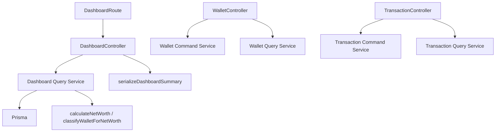

# Dashboard Query Service Architecture (Sprint 3E)

Sprint 3E moves the **dashboard read** out of `dashboard.controller.ts` into a
dedicated **query service**, following the same incremental pattern the
transaction (Sprints 3A/3B) and wallet (Sprints 3C/3D) modules established. The
dashboard is read-only, so — unlike wallet/transaction — there is **no command
counterpart**.

After 3E the dashboard controller is a thin HTTP boundary: it resolves the
authenticated user, calls the query service once, serializes the Decimal result
at the response boundary, and forwards errors. It holds **no** Prisma access, no
`Prisma.Decimal` calculation, and no wallet classification. See
[`architecture-transaction-service.md`](architecture-transaction-service.md) and
[`architecture-wallet-service.md`](architecture-wallet-service.md) for the sibling
modules.

## Grounding: what the dashboard actually is

The live surface is exactly one endpoint — no month/year params, no
income/expense/trend fields, no installment or recent-transaction data, and **no
success envelope** (the response is a bare object). Nothing beyond this was
modeled or invented.

| Aspect | Reality (preserved) |
| --- | --- |
| Route | `GET /api/v1/dashboard/summary` (`requireUser`) |
| Response | **bare** `{ total_aset, total_utang, net_worth }`, status `200`, no `{ success, data, message }` envelope |
| Values | `parseFloat(decimal.toString())` (snake_case fields) |
| Params | none |
| Calculation | `calculateNetWorth`: assets = CASH/BANK/E_WALLET balances; utang = \|debt balances\|; `net_worth` = **asset total only** |
| Archived wallets | included (no `isArchived` filter) |

## What moved, what stayed

| Responsibility | Before (controller) | After |
| --- | --- | --- |
| wallet `findMany` (type + balance) | controller (via `getUserNetWorth`) | **query service** (`getSummary`) |
| net-worth **aggregation** (Decimal) | `utils/financial.getUserNetWorth` | **query service** delegates to `calculateNetWorth` |
| authenticated `userId` resolution | controller | **controller** (`resolveUserId`) |
| Decimal → number **serialization** | controller (inline `parseFloat`) | **controller** (`serializeDashboardSummary`) |
| bare response shape + status | controller | **controller** |
| unexpected error forwarding | controller (`next(err)`) | **controller** (`next(err)`) |

`utils/financial.getUserNetWorth` — the only direct-Prisma read living outside the
service layer, and used solely by this controller — was **removed** as part of the
move. Its two remaining exports, `calculateNetWorth` and
`classifyWalletForNetWorth`, are pure and unchanged; `financial.ts` no longer
imports Prisma.

## Controller — `src/controllers/dashboard.controller.ts`

Before (excerpt): a direct `getUserNetWorth(userId)` call, inline `parseFloat`
serialization, bare `res.status(200).json(...)`.

After: `resolveUserId` → `dashboardQueryService.getSummary({ userId })` →
`serializeDashboardSummary` → bare `res.status(200).json(...)`; `next(err)` on
failure. A `401` guard was added for a missing user, matching the wallet read
controller (`getAllWallets`); in production `requireUser` always injects the id,
so this is invisible to clients.

## Query service — `src/services/dashboard-query.service.ts`

`createDashboardQueryService(db)` with a default `dashboardQueryService` singleton
bound to the shared Prisma. One method: `getSummary({ userId })` →
`DashboardSummaryResult` (Decimals). Ownership-scoped `wallet.findMany` selecting
only `type` + `balance`, delegating arithmetic to `calculateNetWorth`. Empty
wallet set → Decimal zeros (a valid zeroed summary). No writes, no `$transaction`,
no Express types, no reporting-time math (net worth is a point-in-time snapshot,
timezone-independent).

### Why inject Prisma rather than reuse the wallet query service

`walletQueryService.getNetWorth` returns a structurally identical `WalletTotals`,
so reuse was considered. We inject a narrow `Pick<PrismaClient, 'wallet'>` and call
the pure `calculateNetWorth` helper directly instead:

- keeps dependency injection **uniform** with the sibling query services (each owns
  its own narrow Prisma surface);
- a **single** DB call, tested with a plain wallet fake — no singleton coupling;
- **no service-to-service** dependency (and therefore no circular-dependency risk).

The reuse seam is the shared **pure domain helper** (`calculateNetWorth`), not the
sibling service. Dependency direction stays acyclic.

## Query contracts — `src/services/dashboard-query.types.ts`

- `DashboardQueryPrismaClient = Pick<PrismaClient, 'wallet'>` — the only model read.
- `GetDashboardSummaryInput { userId }` — `userId` is the authenticated caller,
  never taken from the client; the endpoint accepts no other parameters.
- `DashboardSummaryResult { totalAset, totalUtang, netWorth }` — exact Decimals;
  serialization is the controller's job.

## Serialization boundary

Exactly one serializer (`serializeDashboardSummary`) converts Decimal → number via
`parseFloat`, at the controller. The service never calls `.toNumber()` /
`parseFloat`. No Decimal leaks into JSON; the bare snake_case shape is preserved.

## Query count — before and after

**1 DB query, unchanged.** Before: one `wallet.findMany` inside `getUserNetWorth`.
After: one `wallet.findMany` inside `getSummary`. No `Promise.all` needed (a single
independent read); no duplicate reads introduced.

## Wallet / transaction service relationship

No dependency was added in either direction. The dashboard service does not call
the wallet or transaction query services; those services do not depend on the
dashboard. The only shared code is the pure `calculateNetWorth` helper.

## Why repository extraction remains deferred

The dashboard adds a single, already-covered query shape
(`wallet.findMany` scoped by `userId`). It introduces no new duplicated ownership
seam, no relation-include duplication, and no Prisma-specific error mapping. A
read-only wallet fake was sufficient to test the service. There is still no
repeated query-error-mapping or cross-service Prisma leakage that a repository
would resolve. **Repository still deferred.**
