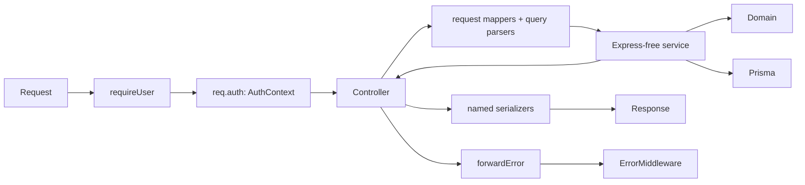

# HTTP & Application Boundary Architecture (Sprint 3F)

Sprints 3A–3E moved business logic out of the controllers into Express-free
services (transaction, wallet, dashboard — each a command and/or query service).
Sprint 3F standardizes the **HTTP boundary that sits in front of those
services**: how identity is established, how requests are mapped into service
inputs, how results are serialized, and how errors are forwarded.

No business rules changed. See the sibling docs for the services themselves:
[`architecture-transaction-service.md`](architecture-transaction-service.md),
[`architecture-wallet-service.md`](architecture-wallet-service.md),
[`architecture-dashboard-service.md`](architecture-dashboard-service.md).



## The one rule that explains the rest

> **TypeScript types do not validate network input.** A `req.body`/`req.query`
> generic only describes what the code *assumes*; at runtime a field can be
> missing, an array, or an object. Runtime parsing (scalar coercion, allowlists)
> is what actually makes input safe. Route generics complement it — they never
> replace it.

## Canonical authenticated request context

There is exactly **one** authoritative source of "who is calling": `req.auth`,
an `AuthContext` published by `requireUser` after a successful auth decision.

```ts
// src/http/authContext.ts
export interface AuthContext {
  userId: string;
  email?: string;
  method: 'jwt' | 'legacy-api-key';
}
```

`req.auth` is added to every Express `Request` by declaration merging
(`src/types/express.d.ts`), so no controller needs a bespoke request subtype or a
`(req as any)` cast. Controllers read it only through the helper:

```ts
const userId = getAuthenticatedUserId(req); // string | undefined — pure read
```

The helper never inspects headers, never verifies a token, and never sends a
response — each controller decides how to react to an absent identity (its
existing status code).

**No dual authority.** `requireUser` no longer mutates `req.body.userId` or
`req.query.userId`, and no controller reads a userId from the body or query. A
client-supplied `userId` (header, query, or body) can therefore never become
authoritative — the identity is always the value auth resolved.

**No mirrors (Sprint 3H).** The deprecated `req.userId` / `req.authMethod`
request mirrors have been **removed**. Sprint 3G migrated the installment
controller and Sprint 3H migrated the last reader — rate-limit keying — to
`req.auth`, so `requireUser` now writes `req.auth` and nothing else. `req.auth`
is the sole trusted representation of request identity; `src/types/express.d.ts`
no longer declares the mirror properties. See
[Rate limiting](#rate-limiting-sprint-3h) below.

### Auth middleware contract

After `requireUser` calls `next()` (i.e. auth succeeded), it guarantees:

| Guarantee | Detail |
| --- | --- |
| `req.auth.userId` | the trusted, resolved user id |
| `req.auth.method` | `'jwt'` for a verified Supabase JWT, `'legacy-api-key'` for the deprecated compat path |
| No secrets in context | `req.auth` carries **no** raw token and **no** API key |
| Fail-closed | a failed auth returns 401 and the downstream controller never runs, so no context leaks |

The decision logic itself (bearer-token-is-authoritative, no fallback, JWT-only
mode, legacy compat) is unchanged from the security sprints — 3F only changed how
the *result* is published. Covered by `test/auth.test.ts` (decisions) and
`test/authContext.test.ts` (the context contract).

## Rate limiting (Sprint 3H)

Rate limiting is **two layers**, split around authentication. This is required
because `requireUser` runs *per route* (inside the router), so a limiter mounted
globally on `/api` necessarily executes **before** any identity is resolved.


| Limiter | Where it runs | Key | Purpose |
| --- | --- | --- | --- |
| **general** (`generalLimiter`) | globally on `/api`, **before** auth | `ip:<normalized>` | caps all traffic and protects the token / API-key verification path itself |
| **mutation** (`mutationLimiter`) | per mutating route, **after** `requireUser` | `user:<req.auth.userId>`, IP fallback | stricter cap on writes, partitioned per verified user |

**Why user-keying is safe here.** The mutation limiter runs only *after* a
successful auth decision, so `req.auth.userId` is a verified identity (a JWT
`sub` or a resolved legacy user). It is read via `getAuthenticatedUserId` — the
same helper controllers use. The self-asserted `x-user-id` header and any
body/query `userId` are **never** consulted, so a client cannot select another
user's bucket. On routes that resolve no user (the API-key-only `/users/sync`),
`req.auth` is absent and the limiter falls back to `ip:` — writes there are still
capped, just by IP.

**Namespacing & normalization.** Keys are prefixed (`ip:` vs `user:`) so a user
id that happens to look like an IP can never collide with a real IP bucket. IP
keys go through `express-rate-limit`'s `ipKeyGenerator`, which collapses IPv6
into a subnet; `req.ip` derivation is governed by the unchanged
`app.set('trust proxy', trustProxy)` config (defaults to *not* trusting
`X-Forwarded-For`). Keys carry **no** token, API key, or email.

**Preserved.** Windows, `RATE_LIMIT_MAX` / `RATE_LIMIT_MUTATION_MAX`, the
`RATE_LIMIT_ENABLED` switch (the mutation limiter honors it via `skip`), standard
`RateLimit-*` headers, the `429` JSON envelope, `OPTIONS`/`GET`/`HEAD` skips, and
the per-instance in-memory store are all unchanged. The store remains
per-process; a shared store (Redis) is still the future scale-out step. The one
intended behavior refinement: authenticated writes are now partitioned per user
instead of per IP, so users behind a shared NAT no longer share a write budget.
Covered by `test/rateLimitAuth.test.ts` and `test/httpSecurity.test.ts`.

## Responsibilities

| Layer | Owns | Never does |
| --- | --- | --- |
| **Middleware** (`requireUser`) | authentication, publishing `req.auth` | business logic, serialization |
| **Controller** | read `req.auth`, call mapper → service → serializer, forward errors | Prisma access, Decimal math, business validation |
| **Request mapper** | allowlist fields, structural extraction into a typed service input | trust body/query userId, spread raw body/query, DB access, calculations |
| **Query parser** | reduce `req.query` values to safe scalars | schema/business validation, clamp/default (that stays in services) |
| **Service** | business rules, Prisma, `Prisma.Decimal` values | anything Express (`Request`/`Response`/`next`) |
| **Serializer** | `Prisma.Decimal` → API `number`/`string`/`null` at the response edge | calculations, changing field casing/shape |

### Request mappers (structural, not business)

Mappers are explicit allowlists. They never spread `req.body`/`req.query` into a
service input and never read a userId from the request payload. Example:

```ts
// Controllers call the service with a mapper output, never { userId, ...req.body }
type CreateTransactionRequestInput = Omit<CreateTransactionInput, 'userId'>;
```

**Structural** validation lives here (field is a scalar not an array/object;
route id present; `?force=true` only when literally `'true'`). **Business**
validation stays in the services (amount > 0, wallet ownership, self-transfer,
debt credit-limit rules). The two are never duplicated.

### Query parsing (`src/http/queryParsers.ts`)

Express parses `req.query` values as `string | ParsedQs | array`. The parsers
collapse that to a safe scalar *before* it reaches a service or Prisma:

| Helper | Behavior |
| --- | --- |
| `scalarString(v)` | string→string; array→first element's scalar; object→`undefined` (never `"[object Object]"`) |
| `scalarInt(v)` | scalar integer, else `undefined` — **`NaN` never reaches a service** |
| `scalarBooleanTrue(v)` | `true` only for the exact string `'true'` |

The existing **lenient** month/year/limit clamp/default (e.g. `month 13 → 12`,
`limit > 200 → 200`) is **unchanged** and still lives in the services. 3F only
guarantees a scalar *shape*; it does **not** tighten those lenient semantics.
Stricter field validation (rejecting `month=13`) remains a future,
frontend-approved behavior change.

## Serialization boundary

Services return `Prisma.Decimal`/domain values; the **controller** converts them
to JSON at named, pure serializers — the single place `Decimal → number` happens:

`serialize` (transaction), `serializeSummary`, `serializeWallet`,
`serializeSparkline`, `serializeNetWorth`, `serializeDashboardSummary`.

Preserved exactly: `null` stays `null` (e.g. pre-creation sparkline points),
snake_case dashboard fields, the bare (un-enveloped) dashboard response, the
`{ success, data, message }` envelope for transaction/wallet, wallet debt-derived
fields (`sisa_limit`, `outstanding_debt`), and Decimal-cent precision. No
`Prisma.Decimal` reaches JSON, and no `parseFloat`/`Number(` lives outside a
serializer.

## Operational error forwarding (`src/http/forwardError.ts`)

One helper replaces the previously duplicated `forwardTransactionError` /
`forwardWalletError`:

```ts
forwardError(err, res, next);
```

It recognizes an operational error **structurally** (`isOperational === true`
plus numeric `statusCode` and string `code`) — so it does not import each
domain's error class and does not merge unrelated hierarchies. Operational errors
keep their exact status/code/message through the standard envelope (`sendError`);
everything else propagates untouched to the central error handler
(`middlewares/error.middleware.ts`), which redacts internals and attaches a
correlation id. Controllers never manufacture a 500.

## Defense-in-depth change (the one identified hardening)

Before 3F, the transaction and wallet read/update/delete/sparkline handlers cast
`(req as any).userId as string` with **no guard**. If `requireUser` were ever
absent from a route, `userId` would be `undefined`; Prisma treats `where: {
userId: undefined }` as *no filter*, which would drop ownership scoping. 3F adds
an explicit `if (!userId) 401` guard to every such handler so `undefined` can
never reach a scoped query. This path is unreachable in production (`requireUser`
runs on all these routes) and is covered by `test/httpBoundaryGuards.test.ts`.

## Deliberate non-goals (deferred, with rationale)

- **No validation framework (Zod/Joi/…).** The only real duplication was two
  6-line error forwarders (now one). Adding a schema library would either
  duplicate the services' business validation or force a lenient→strict behavior
  change the frontend has not approved. A focused parser module covers the one
  real boundary and is trivial to extend or remove. Re-evaluate if/when strict
  query validation is approved.
- **No repository layer.** Services already inject a narrow `Prisma.Pick`, which
  is enough for testing with fakes. Persistence abstraction remains a separate,
  deferred question.
- **Body value fields stay typed by their DTOs.** Structural hardening focused on
  query shape and identity (the actual risks). Deep structural validation of
  every body field would risk behavior changes (400 vs 500) and is a candidate
  for the same future validation effort.

## Files

| File | Role |
| --- | --- |
| `src/http/authContext.ts` | `AuthContext`, `getAuthContext`, `getAuthenticatedUserId` |
| `src/types/express.d.ts` | `req.auth` declaration merge (no deprecated mirrors) |
| `src/http/queryParsers.ts` | `scalarString` / `scalarInt` / `scalarBooleanTrue` |
| `src/http/forwardError.ts` | `forwardError` / `isOperationalError` |
| `src/middleware/apiKeyAuth.ts` | `requireUser` publishes `req.auth` (only) |
| `src/middleware/rateLimit.ts` | `generalLimiter` (IP), `mutationLimiter` (user/IP), `ipKey` / `userOrIpKey` |
| `src/controllers/*.controller.ts` | thin HTTP adapters using the above |
