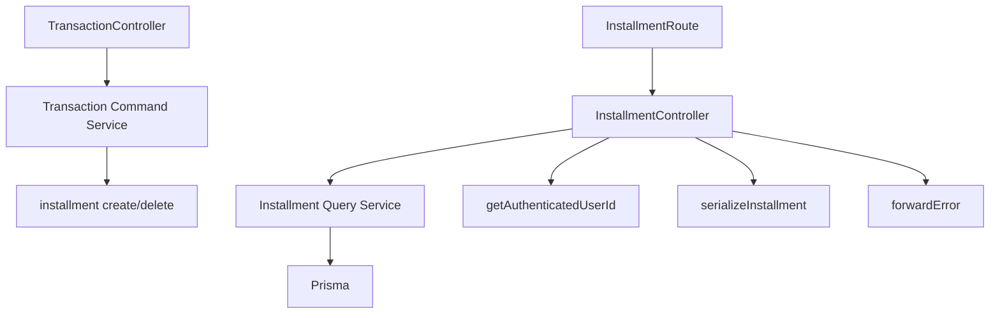

# Installment Query Service Architecture (Sprint 3G)

Sprint 3G moves the **installment list read** out of `installment.controller.ts`
into a dedicated **query service**, following the same incremental pattern the
transaction (Sprints 3A/3B), wallet (Sprints 3C/3D), and dashboard (Sprint 3E)
modules established, and migrates the controller's identity read from the
deprecated `req.userId` mirror to the canonical `req.auth` context introduced in
Sprint 3F. See [`architecture-http-boundary.md`](architecture-http-boundary.md).

The installment HTTP surface is **read-only**, so — like dashboard, unlike
wallet/transaction — there is **no command counterpart**. Installment *mutations*
already live in the **transaction command service** and stay there (see
[relationship](#relationship-with-the-transaction-command-service) below); a
command service purely for symmetry was deliberately **not** created.

After 3G the installment controller is a thin HTTP boundary: it resolves the
authenticated user via `getAuthenticatedUserId(req)`, structurally parses the
`status` query scalar, calls the query service once, serializes the Decimal
result at the response boundary, and forwards errors through the shared
`forwardError`. It holds **no** Prisma access, no `Prisma.Decimal` calculation,
and no status classification.

## Grounding: what the installment surface actually is

Two read routes, both `requireUser`. The list reports each installment's **stored
contract values** verbatim; there is **no** paid-terms / payment-lifecycle field
in the schema, so **no progress or remaining amount is computed** — that limitation
is preserved, not "fixed" by inventing payment tracking. `status` is a persisted
column, so classification is a stored-value read, not date arithmetic (no reporting
timezone is involved on this path).

| Aspect | Reality (preserved) |
| --- | --- |
| Routes | `GET /api/v1/installments` (list), `GET /api/v1/installments/rates` (static) |
| Auth | `requireUser` on both |
| Response | `{ success, data, message }` envelope; list `message` = `Retrieved installments`, rates `message` = `Retrieved paylater rates` |
| Ownership | `Installment.userId` (direct column) — every read scoped to the authenticated caller |
| Filter | optional `?status=` — `ACTIVE` \| `SETTLED` \| `CANCELLED`; falsy (absent/empty) = no filter; unknown value = `400 BAD_REQUEST` |
| Ordering | `startDate desc` |
| Include | `wallet { id, name, type }` (relation) |
| Serialized fields | `id, description, walletId, walletName, walletType, monthlyAmount, currentTerm, installmentMonths, totalAmount, grandTotal, totalInterest, interestRate, status, startDate, balanceDeducted` |
| Money serialization | `parseFloat(decimal.toString())` at the controller boundary |
| Rates endpoint | static config array; **no** identity, **no** database access |



## What moved, what stayed

| Responsibility | Before (controller) | After |
| --- | --- | --- |
| authenticated identity | `(req as any).userId` (deprecated mirror, **no guard**) | **controller** `getAuthenticatedUserId(req)` + `401` guard |
| `status` structural parse | inline `req.query.status` | **controller** `scalarString(req.query.status)` |
| `status` allowlist validation → 400 | controller (`sendError`) | **query service** (throws typed `InstallmentError`) |
| `installment.findMany` (scope + include + order) | controller | **query service** (`listInstallments`) |
| Decimal → number **serialization** | controller (inline `parseFloat`) | **controller** (`serializeInstallment`) |
| envelope + message + status | controller | **controller** |
| unexpected error forwarding | controller (`next(err)`) | **controller** (`forwardError`) |
| static rates endpoint | controller | **controller** (unchanged — pure config) |

The old handler read `(req as any).userId` with **no** guard: an unauthenticated
request would have reached `findMany({ where: { userId: undefined } })`. A tested
`401` guard now closes that path. In production `requireUser` always injects the
id, so this is invisible to clients.

## Controller — `src/controllers/installment.controller.ts`

`getAuthenticatedUserId(req)` → `401` guard → `installmentQueryService.listInstallments({ userId, status: scalarString(req.query.status) })`
→ `serializeInstallment` per row → `sendSuccess(..., 'Retrieved installments')`;
`forwardError(err, res, next)` on failure. `getPaylaterRates` stays a thin handler
returning a static array (no identity, no DB), so it needs no service.

## Query service — `src/services/installment-query.service.ts`

`createInstallmentQueryService(db)` with a default `installmentQueryService`
singleton bound to the shared Prisma. One method: `listInstallments({ userId, status })`
→ `InstallmentListItem[]` (Decimals intact). Ownership-scoped `installment.findMany`
with the `wallet { id, name, type }` include and `startDate desc` order. Status
validation lives here: a falsy value means no filter (matching the old `status &&`
semantics), a non-empty invalid value throws `InstallmentError('Invalid status.
Allowed: …', 400, 'BAD_REQUEST')` **before** any read. No writes, no `$transaction`,
no Express types, no reporting-time math (status is a persisted column).

Because today's `sendError(msg, 400)` already resolved code `BAD_REQUEST` via
`CODE_BY_STATUS`, routing the same message through `forwardError` →
`sendError(msg, 400, 'BAD_REQUEST')` yields a **byte-identical** error envelope.

## Query contracts — `src/services/installment-query.types.ts`

- `InstallmentQueryPrismaClient = Pick<PrismaClient, 'installment'>` — the only
  model directly queried (wallet fields arrive via the relation `include`, not a
  direct `wallet` read).
- `ListInstallmentsInput { userId; status? }` — `userId` is the authenticated
  caller, never taken from the client; `status` is the raw client scalar, left
  unvalidated by design (the service classifies it).
- `InstallmentListItem = Prisma.InstallmentGetPayload<{ include: { wallet: { select: { id, name, type } } } }>`
  — exact Decimals; serialization is the controller's job.

## Typed errors — `src/services/installment.errors.ts`

`InstallmentError` mirrors `TransactionError` / `WalletError`: `statusCode`,
`code`, `isOperational = true`, `instanceof`-safe. `forwardError` recognises it
**structurally** (via `isOperational`), so no error-class import is needed at the
boundary. The only operational error the read path raises is the `400 BAD_REQUEST`
invalid-status filter; unexpected Prisma failures propagate untyped to the central
error handler (redacted 5xx + correlation id).

## Serialization boundary

Exactly one serializer (`serializeInstallment`) converts Decimal → number via
`parseFloat`, at the controller. The service never calls `.toNumber()` /
`parseFloat`. No Decimal leaks into JSON; field names, ordering, and `startDate`
(a `Date`, JSON-encoded to ISO) are preserved.

## Relationship with the transaction command service

Installment **writes** are owned by `transaction.service.ts` and stay there:

- **create** — an installment is created inside the transaction's atomic
  `$transaction` (Model A: one `Installment` ↔ one `Transaction`; the wallet is
  locked for the full `grandTotal`), using `computeInstallmentPlan` (Decimal-safe).
- **delete** — on transaction reversal, the linked installment row is deleted and
  the wallet effect (the stored `grandTotal`, not `monthlyAmount`) is reversed from
  the persisted row, never from request data (Sprint 2A/2B semantics preserved).

Dependency direction stays acyclic and one-way:

```text
Transaction Command Service → installment persistence (create/delete)
Installment Query Service    → installment read/reporting
```

The installment query service does **not** call the transaction service, and the
transaction service does **not** call the installment query service. No
service-to-service coupling, no circular dependency.

## Deprecated identity mirror

After 3G the installment controller no longer reads `req.userId`. The **only**
remaining real reader of the deprecated `req.userId` mirror is the rate-limit
middleware (`src/middleware/rateLimit.ts`, `keyByUserOrIp`). Removing the mirror is
therefore **deferred**: it requires the limiter to read `req.auth` instead, which
is only safe once middleware ordering is confirmed to publish `req.auth` before the
limiter runs. That is out of scope here (Sprint 3G does not refactor rate limiting).

## Why repository extraction remains deferred

The installment query adds a single ownership-scoped shape
(`installment.findMany` by `userId` with one wallet `include`). It introduces no
new duplicated ownership seam, no repeated relation-include across modules, and no
Prisma-specific error mapping. A read-only installment fake was sufficient to test
the service. **Repository still deferred.**
