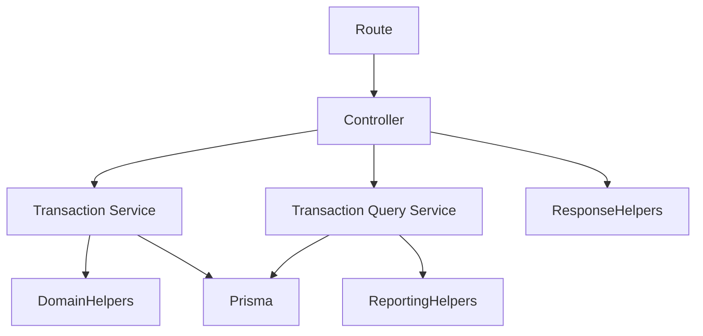

# Transaction Service Architecture (Sprints 3A + 3B)

> **Sprint 3F update:** the controller now reads identity via
> `getAuthenticatedUserId(req)` (`req.auth`), parses query params through the
> scalar helpers, and forwards errors via the shared `forwardError` (the local
> `forwardTransactionError` was removed). See
> [`architecture-http-boundary.md`](architecture-http-boundary.md).

The transaction module is the **first** part of the codebase to move its business
logic out of the controller and into a service layer, now split along a
**command / query** seam:

- **Sprint 3A** extracted the **mutation** path (create / update / delete) into
  `transaction.service.ts`.
- **Sprint 3B** extracted the **read** path (list / all-time / summary) into
  `transaction-query.service.ts`.

Wallet **mutations** followed in **Sprint 3C** — see
[`architecture-wallet-service.md`](architecture-wallet-service.md) — but wallet
**reads** (list, sparkline), dashboard, installment listing, and auth are **not**
yet on this pattern and still hold their logic in their controllers. Do not assume
the whole project follows this architecture.

## Layers



Dependency direction is one-way: routes → controller → services → domain helpers →
Prisma. Nothing in a service points back at Express, and the two services never
call each other.

### Controller — `src/controllers/transaction.controller.ts`

A thin HTTP adapter for **both** paths. Each handler:

- reads route params, query, body, and the authenticated `userId`
- maps an **allowlist** of inputs into typed service input
  (`mapCreateTransactionRequest`, `mapUpdateTransactionRequest`,
  `mapListTransactionQuery`, `mapSummaryQuery`) — never `data: req.body` or a raw
  `req.query`
- calls exactly one service method
- serializes the returned record(s) into the existing success envelope
  (`serialize` for transaction rows, `serializeSummary` for the summary — the one
  Decimal→number boundary)
- forwards errors via `forwardTransactionError`

It does **not** run Prisma queries, open `$transaction`, build `where` objects,
compute balance effects or reporting ranges, run Decimal aggregation, decide
ownership filters, or return manual `500`s. A static scan of the controller finds
no `prisma.`, `findMany`, `groupBy`, `Prisma.Decimal`, `getReportingMonthRange`, or
reporting-config references.

### Command service — `src/services/transaction.service.ts`

Owns the **mutation** behavior: business validation (type, amount, tenor, interest,
transfer shape), ownership of the transaction and every source/destination wallet
and category, default-wallet resolution, business-date normalization, installment
state, the self-transfer / legacy-transfer / installment-edit refusals, the single
`$transaction` boundary per mutation, and reverse-then-apply orchestration. Returns
typed domain records; throws typed `TransactionError`s.

### Query service — `src/services/transaction-query.service.ts`

Owns the **read** behavior:

- ownership-scoped listing (`listTransactions`) and monthly P&L (`getSummary`),
  each requiring an authenticated `userId`
- filter normalization (type validation, limit clamping, month/year
  defaulting/clamping) that **reproduces the controller's prior lenient semantics**
  so the public API is byte-for-byte unchanged
- a single Prisma `where` per query, with the wallet filter combined **in the same
  `where` as `userId`** so a wallet the caller does not own simply yields zero rows
  (cross-user data is impossible; no separate ownership lookup needed)
- reporting-period orchestration through the existing helpers (see below)
- Decimal-exact aggregation and net-savings

It performs **no** mutations, opens **no** write transaction, imports no Express
types, reads no `req`/headers, and never constructs its own Prisma client.

#### Why the summary aggregates in the database

`getSummary` uses Prisma `groupBy` on `type` summing the persisted `amount`. This
is exact and readable because the reporting rules fall out of the query itself:
TRANSFERs are excluded by the `type IN (INCOME, EXPENSE)` filter (they net to zero —
Invariant 4), and an installment expense contributes its persisted **monthly**
`amount` — precisely the aggregate cash-flow effect (`getAggregateCashFlowEffect`
uses `amount`, not the wallet-locking `grandTotal`). Net savings is computed with
Decimal `.minus()`, so there is no float drift, `NaN`, or `Infinity`. In-memory
reporting-effect aggregation would fetch every row for the identical result, so DB
aggregation is preferred here.

### Domain / reporting helpers (reused, unchanged)

The services orchestrate; these calculate:

- `domain/transactionBalance.ts` — `computeBalanceEffect`, `reverseBalanceEffect`,
  `applyBalanceDeltas` (mutation balance-effect source of truth)
- `domain/installment.ts` — `computeInstallmentPlan` (Decimal-safe plan)
- `domain/reportingTime.ts` — `parseBusinessDate` (mutations) and
  `formatReportingDate` + `getReportingMonthRange` (query reporting windows). No
  server-local `Date` month math lives in the services.

## Dependency injection

Each service is a factory over a **narrow Prisma `Pick`**, with a default singleton
for production and injectable fakes for tests — no DI framework:

```ts
createTransactionService(db)       // 'transaction'|'wallet'|'installment'|'category'|'$transaction'
createTransactionQueryService(db)  // 'transaction' only (reads: findMany + groupBy)
```

The query service's surface is deliberately read-only — it has no `$transaction`
and no wallet/category write access, so it *cannot* mutate.

## Serialization boundary

Services return typed domain results with `Decimal` values intact. Conversion to
the numeric JSON response happens in exactly one place — the controller
(`serialize` / `serializeSummary`). Neither service calls `.toNumber()` or
`parseFloat` on business values.

## Why this is not full CQRS

This is a **practical** command/query split, not CQRS infrastructure. There is one
database, one Prisma schema, one consistency model, and no separate read model,
event sourcing, message bus, or write/read replicas. The only thing that is
"separated" is the code: commands live in one service, queries in another, so each
file stays small and single-purpose. Reads observe writes immediately through the
same tables.

## Why a repository layer is still deferred

The query service uses an injected Prisma `Pick` directly rather than a
`TransactionRepository`. A repository is worth adding only once (a) multiple
services duplicate the same query logic, (b) persistence testing is painful, (c)
query complexity justifies the abstraction, or (d) a second persistence backend
becomes realistic. None hold today: a pass-through repository would only mirror
Prisma without adding value, and the narrow `Pick` already makes the services fully
testable with fakes.

## Error propagation

Both services throw `TransactionError` (status + stable code + safe message) for
operational failures and map known Prisma codes (`P2003` → 400, `P2025` → 404) to
typed errors so no Prisma internals leak. The query service reuses the same
`TransactionError` type (e.g. an invalid `type` filter → `400 BAD_REQUEST`). The
controller's `forwardTransactionError` translates a `TransactionError` into the
existing envelope and forwards any **unexpected** error to the central error
handler — never a manual `500`.

## How future modules should follow this

1. Define `*.types.ts` (Express-free inputs/outputs, a narrow Prisma `Pick`) and
   reuse the shared typed-error approach. Split reads and writes into separate
   `*.types.ts` / `*-query.types.ts` when both are non-trivial.
2. Move validation, ownership, business rules, and the `$transaction` boundary into
   a `createXService(db)` command factory; move ownership-scoped reads, filters, and
   aggregates into a `createXQueryService(db)` factory. Give each a default singleton.
3. Reduce the controller to: extract HTTP input → map (allowlist) → call one service
   method → serialize → forward errors.
4. Keep domain/reporting calculations in `domain/`; the services orchestrate them.
5. Add service-level unit tests (injected fake) plus thin controller-boundary tests.
   Defer a repository layer until multiple services need the same queries.
