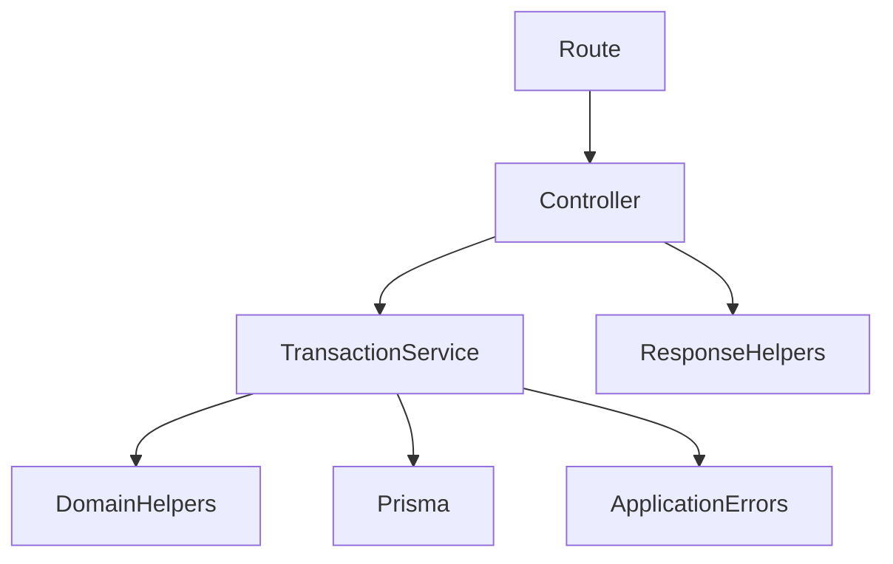

# Transaction Service Architecture (Sprint 3A)

This is the **first incremental extraction** of business logic into a service
layer. It applies to the **transaction mutation** path only (create / update /
delete). Wallets, dashboard, installment listing, auth, and the transaction
read/summary endpoints are **not** yet on this pattern and still hold their logic
in their controllers. Do not assume the whole project follows this architecture.

## Layers

### Controller — `src/controllers/transaction.controller.ts`

HTTP boundary only, for the mutation handlers:

- reads route params, query, body, and the authenticated `userId`
- maps an **allowlist** of body fields into a service input
  (`mapCreateTransactionRequest`, `mapUpdateTransactionRequest`) — never
  `data: req.body`
- calls exactly one service method
- serializes the returned record into the existing success envelope
  (`sendSuccess`, with the `serialize` Decimal→number helper)
- forwards errors via `forwardTransactionError`

It does **not** run Prisma queries, open `$transaction`, compute balance effects,
decide business rules, or return manual `500`s. (The read/summary handlers —
`getAll`, `getAllTime`, `summary` — still query Prisma directly; extracting them
is deferred.)

### Service — `src/services/transaction.service.ts`

Owns the business behavior:

- business validation (type, amount, tenor, interest, transfer shape)
- ownership of the transaction and every source/destination wallet and category
- default-wallet resolution, business-date normalization, installment state
- self-transfer, legacy-transfer, and installment-edit refusals
- the **single `$transaction` boundary** per mutation, and reverse-then-apply
  orchestration
- returns typed domain records; throws typed `TransactionError`s

It imports **no Express types**, calls no `sendSuccess`/`sendError`, reads no
headers or `req`, and never constructs its own Prisma client.

### Domain helpers (reused, unchanged)

The service orchestrates; these calculate:

- `domain/transactionBalance.ts` — `computeBalanceEffect`, `reverseBalanceEffect`,
  `applyBalanceDeltas` (balance-effect source of truth)
- `domain/installment.ts` — `computeInstallmentPlan` (Decimal-safe plan)
- `domain/reportingTime.ts` — `parseBusinessDate` (business-date normalization)

## Prisma transaction ownership

The service opens one `$transaction` per financial mutation and passes the
transaction-scoped client to `applyBalanceDeltas` and the row writes, so all
balance updates and the row change commit or roll back together (atomic
increments/decrements, no read-modify-write, no partial mutation, no retries).
The controller never opens a transaction.

## Dependency injection

`createTransactionService(db: TransactionPrismaClient)` takes a **narrow Pick** of
the Prisma client (`transaction | wallet | installment | category | $transaction`).
Production binds the shared singleton (`export const transactionService`); tests
inject a fake — no DI framework, and **no repository layer** (that is deferred
until the service boundary stabilizes; a pass-through repository would only mirror
Prisma without adding value).

## Error propagation

The service throws `TransactionError` (status + stable code + safe message) for
operational failures and maps known Prisma codes (`P2003` → 400, `P2025` → 404) to
typed errors so no Prisma internals leak. The controller's `forwardTransactionError`
translates a `TransactionError` into the existing error envelope and forwards any
**unexpected** error to the central error handler — never a manual `500`.

## How future modules should follow this

1. Define `*.types.ts` (Express-free inputs/outputs, a narrow Prisma `Pick`) and
   reuse the shared typed-error approach.
2. Move validation, ownership, business rules, and the `$transaction` boundary
   into a `createXService(db)` factory with a default singleton instance.
3. Reduce the controller to: extract HTTP input → map (allowlist) → call service →
   serialize → forward errors.
4. Keep domain calculations in `domain/`; the service orchestrates them.
5. Add service-level unit tests (injected fake) plus thin controller-boundary
   tests. Defer a repository layer until multiple services need the same queries.
