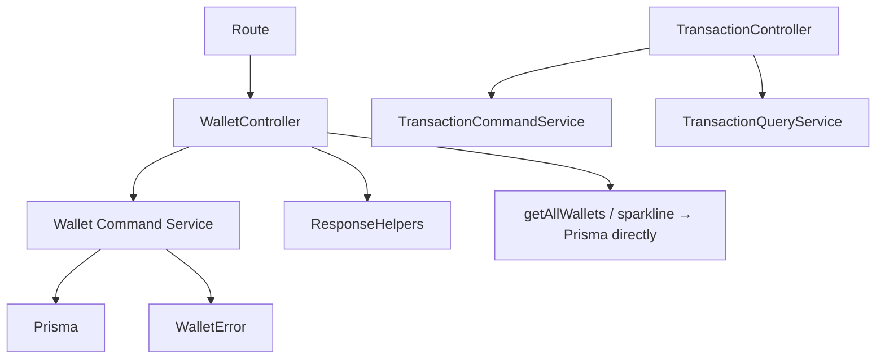

# Wallet Command Service Architecture (Sprint 3C)

Sprint 3C moves the **wallet mutation** logic (create / update / delete) out of
`account.controller.ts` into a dedicated command service, following the same
incremental pattern the transaction module established in Sprints 3A/3B (see
[`architecture-transaction-service.md`](architecture-transaction-service.md)).

Only the **command** (mutation) path is extracted. Wallet **reads** — the list
handler (`getAllWallets`) and the sparkline (`getWalletSparkline`) — deliberately
stay in the controller and still query Prisma directly; they are a later sprint.
Dashboard, net-worth reporting, and reconciliation are also untouched.



## What moved, what stayed

| Responsibility | Before (controller) | After |
| --- | --- | --- |
| name / type / creditLimit validation | in each handler | **service** |
| ownership `findFirst({ id, userId })` | update, delete | **service** |
| Sprint 2A `initialBalance` seeding | create | **service** |
| Sprint 2B ledger boundary (Decimal balance guard) | update | **service** |
| transfer-reference gate (both sides) + force gate | delete | **service** |
| Prisma `create` / `update` / `delete` / `count` | all mutations | **service** |
| Prisma error mapping (`P2003`→400, `P2025`→404) | all catches | **service** |
| authenticated `userId` resolution | create/update/delete | **controller** (HTTP) |
| request field allowlisting | — (raw `req.body`) | **controller** mappers |
| `force` query normalization | delete | **controller** mapper |
| net-worth snapshot (reporting) | all mutations | **controller** (out of scope) |
| response envelope `{ ...wallet, netWorth }` | all mutations | **controller** |
| `getAllWallets`, `getWalletSparkline` (reads) | controller + Prisma | **unchanged** |

## Wallet controller — `src/controllers/account.controller.ts`

After extraction the three mutation handlers are thin HTTP adapters. Each:

- resolves the authoritative `userId` (`requireUser` injects `req.userId`, which
  always wins; a client cannot inject another user's id — the mappers never read a
  body `userId`)
- maps an **allowlist** of inputs into typed service input
  (`mapCreateWalletRequest`, `mapUpdateWalletRequest`, `mapDeleteWalletRequest`) —
  never `data: req.body`
- calls exactly one service method
- appends the reporting net-worth snapshot and sends the existing success envelope
- forwards errors via `forwardWalletError`

The mutation handlers run no Prisma queries, no business validation, no Decimal
comparison, no transfer-reference query, and return no manual `500`. The read
handlers (`getAllWallets`, `getWalletSparkline`) still use Prisma — the static
architecture check targets the **mutation** handlers only, not the whole file.

## Wallet command service — `src/services/wallet.service.ts`

`createWalletService(db)` returns `{ createWallet, updateWallet, deleteWallet }`.
It owns:

- **create** — required-name check, wallet-type validation, the debt-wallet
  `creditLimit` rule, opening-balance coercion, and seeding `balance` **and**
  `initialBalance` from the same value (Sprint 2A). `P2003` → `400`.
- **update** — metadata only. Ownership-scoped load; the **Sprint 2B ledger
  boundary**: `balance` is never written — an unchanged echo is tolerated, any
  change is refused (`BALANCE_UPDATE_NOT_ALLOWED`), a malformed value is refused
  (`INVALID_AMOUNT`), compared with **Decimal** (no float subtraction). Only
  allowlisted fields reach Prisma; `initialBalance` and `userId` are not editable.
  `P2025` → `404`.
- **delete** — ownership check, then two integrity gates before the single write:
  1. a wallet on **either** side of a transfer (`walletId` **or** `toWalletId`) is
     refused even with `force` — cascading its transfer rows would leave the
     counterparty balance without its other side (Sprint 2A). Legacy transfers
     (null destination) still block via their source side.
  2. a wallet with plain income/expense history is refused unless `force`.

  Only then is `wallet.delete` issued; transactions cascade via the schema. No
  unrelated wallet is ever mutated. `P2025` → `404`.

The service imports no Express types, reads no `req`/headers, calls no response
helpers, constructs no Prisma client, and performs no dashboard/reporting math. It
returns the raw Prisma wallet (Decimal fields intact) or a `{ id }` delete result,
or throws a typed `WalletError`.

### No `$transaction` here — on purpose

Every wallet mutation is a **single** write (create, update, or delete; the
cascade is the schema's job). There are no multiple dependent writes to make
atomic, so the service opens no `$transaction` and its Prisma `Pick` omits it —
per the sprint rule "do not add a transaction when one atomic write suffices."
This is the one structural difference from the transaction command service, which
*does* own a `$transaction` because a mutation touches a row plus one or two wallet
balances together.

## Dependency injection

```ts
export type WalletPrismaClient = Pick<PrismaClient, 'wallet' | 'transaction'>;
createWalletService(db); // default singleton: walletService, bound to shared prisma
```

`transaction` is present only for the pre-delete `count` checks. Tests inject a
behavior fake (`test/walletService.test.ts`); the controller boundary is tested
with the service mocked (`test/walletControllerBoundary.test.ts`). No DI framework.

## Typed errors

`WalletError` mirrors `TransactionError` (status + stable code + safe message,
`isOperational`). `forwardWalletError` translates it into the existing envelope and
forwards any **unexpected** error to the central handler untouched. The existing
codes/messages are preserved exactly: create validation → `BAD_REQUEST`;
not-found → `NOT_FOUND`; the balance guard → `INVALID_AMOUNT` /
`BALANCE_UPDATE_NOT_ALLOWED`; delete conflicts → `CONFLICT`.

## Wallet type rules (documented, unchanged)

`WalletType` = `CASH`, `BANK`, `E_WALLET` (assets) and `CREDIT_CARD`,
`LOAN_PAYLATER` (debts). `creditLimit` is required (> 0) **only** for a debt wallet
at create time. Wallet **type is changeable on update** today, with no restriction;
this refactor preserves that. A type change could in principle shift a wallet's
net-worth classification (asset ↔ debt) for historical reporting — that is a
pre-existing property, documented here rather than "fixed" with an invented
restriction, since correctness does not require one.

## No `isDefault` / default-wallet behavior

The `Wallet` schema has **no** `isDefault` field. There is no "one default wallet
per user" rule coupled to wallet mutations, so none was moved into the service.
`isArchived` exists but is a plain metadata boolean with no atomic multi-wallet
rule.

## Why wallet reads and a repository are deferred

- **Reads** (list, sparkline) stay in the controller because they involve
  reporting-time bucketing (`getRollingDayRanges`, `getWalletReportingEffect`) that
  is out of this sprint's scope; extracting a `wallet-query.service.ts` is a
  separate, later decision — exactly as transaction reads were split out in 3B only
  after 3A.
- A **repository** is still not justified: the command service uses the injected
  Prisma `Pick` directly, no other service duplicates wallet data access, and the
  narrow `Pick` already makes it fully testable with fakes. Add one only when
  multiple services share the same queries or a second backend becomes realistic.

## Project status

The **transaction** module is fully command/query split (3A + 3B). The **wallet**
module now has its **mutation** path on the command-service pattern (3C); wallet
reads, dashboard, installment listing, and auth still hold logic in their
controllers. Do not assume the whole project follows this architecture yet.
