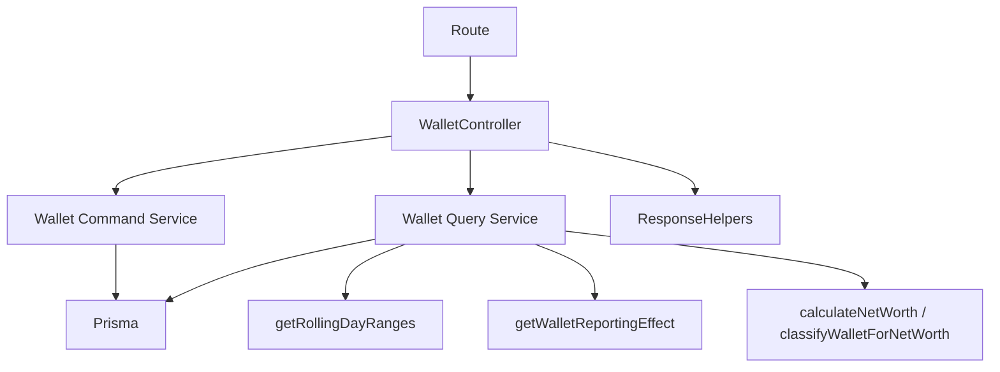

# Wallet Command & Query Service Architecture (Sprints 3C–3D)

> **Sprint 3F update:** the controller now reads identity via
> `getAuthenticatedUserId(req)` (`req.auth`) — the `resolveUserId` body/query
> fallback was removed — parses `?force` via `scalarBooleanTrue`, and forwards
> errors via the shared `forwardError` (the local `forwardWalletError` was
> removed). See [`architecture-http-boundary.md`](architecture-http-boundary.md).

Sprint 3C moved the **wallet mutation** logic (create / update / delete) out of
`account.controller.ts` into a dedicated command service. **Sprint 3D** completes
the split by moving the **wallet reads** — the list handler (`getAllWallets`), the
net-worth snapshot, and the seven-day sparkline (`getWalletSparkline`) — into a
dedicated **query service**, following the same incremental pattern the
transaction module established in Sprints 3A/3B (see
[`architecture-transaction-service.md`](architecture-transaction-service.md)).

After 3D the wallet controller is a thin HTTP boundary: it holds **no** direct
Prisma access, no reporting-time/effect math, and no `Prisma.Decimal` reporting
calculation. Both paths — command and query — own their own narrow injected Prisma
surface. Installment listing and reconciliation are untouched. (The dashboard read
was later extracted in Sprint 3E — see
[`architecture-dashboard-service.md`](architecture-dashboard-service.md) — which
also removed the now-unused `getUserNetWorth` helper.)



## What moved, what stayed

| Responsibility | Before (controller) | After |
| --- | --- | --- |
| name / type / creditLimit validation | in each handler | **service** |
| ownership `findFirst({ id, userId })` | update, delete | **service** |
| Sprint 2A `initialBalance` seeding | create | **service** |
| Sprint 2B ledger boundary (Decimal balance guard) | update | **service** |
| transfer-reference gate (both sides) + force gate | delete | **service** |
| Prisma `create` / `update` / `delete` / `count` | all mutations | **service** |
| Prisma error mapping (`P2003`→400, `P2025`→404) | all catches | **service** |
| authenticated `userId` resolution | create/update/delete | **controller** (HTTP) |
| request field allowlisting | — (raw `req.body`) | **controller** mappers |
| `force` query normalization | delete | **controller** mapper |
| net-worth snapshot **aggregation** (reporting) | controller (`getUserNetWorth`) | **query service** (`getNetWorth`) |
| net-worth snapshot **serialization** | controller | **controller** (`serializeNetWorth`) |
| response envelope `{ ...serializeWallet(wallet), netWorth }` | all mutations | **controller** |
| wallet listing `findMany` + ordering + archived inclusion | controller (`getAllWallets`) | **query service** (`listWallets`) |
| list serialization + `sisa_limit` / `outstanding_debt` | controller | **controller** (`serializeWallet`) |
| sparkline ownership check + tx query + reconstruction | controller (`getWalletSparkline`) | **query service** (`getWalletSparkline`) |
| sparkline serialization (Decimal → number \| null) | controller | **controller** (`serializeSparkline`) |

## Wallet controller — `src/controllers/account.controller.ts`

After extraction the three mutation handlers are thin HTTP adapters. Each:

- resolves the authoritative `userId` (`requireUser` injects `req.userId`, which
  always wins; a client cannot inject another user's id — the mappers never read a
  body `userId`)
- maps an **allowlist** of inputs into typed service input
  (`mapCreateWalletRequest`, `mapUpdateWalletRequest`, `mapDeleteWalletRequest`) —
  never `data: req.body`
- calls exactly one service method
- serializes the returned wallet via `serializeWallet` (create/update return the
  same Decimal→number shape as `getAllWallets` — no client special-casing)
- appends the reporting net-worth snapshot and sends the existing success envelope
- forwards errors via `forwardWalletError`

The two **read** handlers are equally thin after 3D: resolve `userId`, call one
query-service method, serialize at the boundary, forward errors. `getAllWallets`
maps rows through `serializeWallet`; `getWalletSparkline` through
`serializeSparkline`. Neither touches Prisma.

The whole file now runs **no** direct Prisma query — the static architecture check
covers the entire controller, not just the mutation handlers. The only tokens the
scan tolerates are `parseFloat`/`Number(...)` **inside the three serializers**
(`serializeWallet`, `serializeNetWorth`, `serializeSparkline`) — the single,
intentional Decimal → number response boundary.

### Serialization boundary

The query service returns Decimals (and `null` for pre-creation sparkline days);
the controller converts to the existing numeric API shape at exactly one place:

```text
Query service → Decimal / Decimal-or-null result
Controller serializer (serializeWallet / serializeNetWorth / serializeSparkline)
sendSuccess
```

No `.toNumber()`/`parseFloat` runs inside a query-service calculation; `null` is
never coerced to `0`.

## Wallet command service — `src/services/wallet.service.ts`

`createWalletService(db)` returns `{ createWallet, updateWallet, deleteWallet }`.
It owns:

- **create** — required-name check, wallet-type validation, the debt-wallet
  `creditLimit` rule, opening-balance coercion, and seeding `balance` **and**
  `initialBalance` from the same value (Sprint 2A). `P2003` → `400`.
- **update** — metadata only. Ownership-scoped load; the **Sprint 2B ledger
  boundary**: `balance` is never written — an unchanged echo is tolerated, any
  change is refused (`BALANCE_UPDATE_NOT_ALLOWED`), a malformed value is refused
  (`INVALID_AMOUNT`), compared with **Decimal** (no float subtraction). Only
  allowlisted fields reach Prisma; `initialBalance` and `userId` are not editable.
  `P2025` → `404`.
- **delete** — ownership check, then two integrity gates before the single write:
  1. a wallet on **either** side of a transfer (`walletId` **or** `toWalletId`) is
     refused even with `force` — cascading its transfer rows would leave the
     counterparty balance without its other side (Sprint 2A). Legacy transfers
     (null destination) still block via their source side.
  2. a wallet with plain income/expense history is refused unless `force`.

  Only then is `wallet.delete` issued; transactions cascade via the schema. No
  unrelated wallet is ever mutated. `P2025` → `404`.

The service imports no Express types, reads no `req`/headers, calls no response
helpers, constructs no Prisma client, and performs no dashboard/reporting math. It
returns the raw Prisma wallet (Decimal fields intact) or a `{ id }` delete result,
or throws a typed `WalletError`.

### No `$transaction` here — on purpose

Every wallet mutation is a **single** write (create, update, or delete; the
cascade is the schema's job). There are no multiple dependent writes to make
atomic, so the service opens no `$transaction` and its Prisma `Pick` omits it —
per the sprint rule "do not add a transaction when one atomic write suffices."
This is the one structural difference from the transaction command service, which
*does* own a `$transaction` because a mutation touches a row plus one or two wallet
balances together.

## Dependency injection

```ts
export type WalletPrismaClient = Pick<PrismaClient, 'wallet' | 'transaction'>;
createWalletService(db); // default singleton: walletService, bound to shared prisma
```

`transaction` is present only for the pre-delete `count` checks. Tests inject a
behavior fake (`test/walletService.test.ts`); the controller boundary is tested
with the service mocked (`test/walletControllerBoundary.test.ts`). No DI framework.

## Wallet query service — `src/services/wallet-query.service.ts` (Sprint 3D)

`createWalletQueryService(db)` returns `{ listWallets, getNetWorth, getWalletSparkline }`.
It **orchestrates** reads; the arithmetic stays in the domain/util modules it
reuses. It owns:

- **listWallets** — ownership-scoped `findMany` (`where: { userId }`), ordered
  `createdAt` **asc**, archived wallets **included** (no `isArchived` filter),
  relations/fields unchanged. Returns raw Prisma wallets (Decimals intact).
- **getNetWorth** — ownership-scoped read of `type` + `balance`, then the shared
  Decimal-safe `calculateNetWorth` (`utils/financial`). Product rule preserved
  exactly: `totalAset` = asset balances, `totalUtang` = |debt balances|,
  `netWorth` = **asset total only** (debt is reported separately, never
  subtracted). Assets = `CASH`/`BANK`/`E_WALLET`; debt = `CREDIT_CARD`/
  `LOAN_PAYLATER`. Used by the three mutation responses (the reporting snapshot).
- **getWalletSparkline** — ownership check (`findFirst({ id, userId })`, typed
  `404` `NOT_FOUND` otherwise), then the seven-day reconstruction moved verbatim.
  Sprint 2C semantics preserved: exactly seven reporting-calendar days
  (today−6 … today) in `REPORTING_TIMEZONE` via `getRollingDayRanges`; both
  transfer sides queried (`walletId` **OR** `toWalletId`) with a half-open
  `[gte, lt)` window and stable `date/createdAt/id` ordering (no row limit — every
  relevant row is fetched); the stored balance walked backward through
  `getWalletReportingEffect` (income/expense source, transfer out/in, installment
  `grandTotal` — the type switch is **not** reimplemented); empty days carry
  forward; a day ending before `createdAt` is `null` (never `0`); future-dated
  effects (after `now`) are reversed out so they never inflate a realized close. A
  legacy transfer (null destination) affects **only** its known source side; the
  destination is never inferred — a metadata-free `logger.warn` is emitted, no
  repair is attempted (reconciliation is untouched). An optional `now` test clock
  makes the window deterministic; production passes none.

Like the command service it imports no Express types, reads no `req`/headers,
sends no HTTP responses, constructs no Prisma client, and performs **no writes**
(its `Pick` exposes only reads). It returns typed results (`Wallet[]`,
`WalletTotals`, `WalletSparklinePoint[]` — Decimals intact) or throws `WalletError`.

```ts
export type WalletQueryPrismaClient = Pick<PrismaClient, 'wallet' | 'transaction'>;
createWalletQueryService(db); // default singleton: walletQueryService, bound to shared prisma
```

`wallet.findMany`/`findFirst` serve listing + net-worth + ownership;
`transaction.findMany` serves the sparkline. Tests inject a behavior fake
(`test/walletQueryService.test.ts`); the read controller boundary is tested with
the query service mocked (`test/walletQueryControllerBoundary.test.ts`).

### No wallet-detail endpoint

There is **no** `GET /wallets/:id`. The wallet routes are `GET /`,
`GET /:id/sparkline`, `POST /`, `PUT /:id`, `DELETE /:id`. No single-wallet detail
read exists, so none was invented; `getWallet` is intentionally absent from the
query service.

## Typed errors

`WalletError` mirrors `TransactionError` (status + stable code + safe message,
`isOperational`). `forwardWalletError` translates it into the existing envelope and
forwards any **unexpected** error to the central handler untouched. The existing
codes/messages are preserved exactly: create validation → `BAD_REQUEST`;
not-found → `NOT_FOUND`; the balance guard → `INVALID_AMOUNT` /
`BALANCE_UPDATE_NOT_ALLOWED`; delete conflicts → `CONFLICT`.

## Wallet type rules (documented, unchanged)

`WalletType` = `CASH`, `BANK`, `E_WALLET` (assets) and `CREDIT_CARD`,
`LOAN_PAYLATER` (debts). `creditLimit` is required (> 0) **only** for a debt wallet
at create time. Wallet **type is changeable on update** today, with no restriction;
this refactor preserves that. A type change could in principle shift a wallet's
net-worth classification (asset ↔ debt) for historical reporting — that is a
pre-existing property, documented here rather than "fixed" with an invented
restriction, since correctness does not require one.

## No `isDefault` / default-wallet behavior

The `Wallet` schema has **no** `isDefault` field. There is no "one default wallet
per user" rule coupled to wallet mutations, so none was moved into the service.
`isArchived` exists but is a plain metadata boolean with no atomic multi-wallet
rule.

## Why a repository is still deferred

A **repository** is not justified even now that both wallet paths are extracted:

- the command and query services each use their own narrow injected Prisma `Pick`
  directly, and both are already fully testable with fakes (no repository needed
  to mock persistence);
- no other service duplicates wallet data access — there is no proven shared
  persistence logic to hoist;
- there is only one persistence backend, so an abstraction over Prisma buys
  nothing today.

Reevaluate after the **dashboard** service is extracted: if it re-derives the same
wallet reads (net-worth, classification), a shared read seam may finally be worth
it. Until then, adding a repository would be speculative indirection.

## Project status

The **transaction** module is fully command/query split (3A + 3B). The **wallet**
module is now **also** fully command/query split (3C + 3D): mutations in
`wallet.service.ts`, reads in `wallet-query.service.ts`, and `account.controller.ts`
reduced to an HTTP boundary with no direct Prisma. **Dashboard**, installment
listing, and auth still hold logic in their controllers — do not assume the whole
project follows this architecture yet. Dashboard is the recommended next target;
it still calls `getUserNetWorth` directly and is deliberately untouched here.
